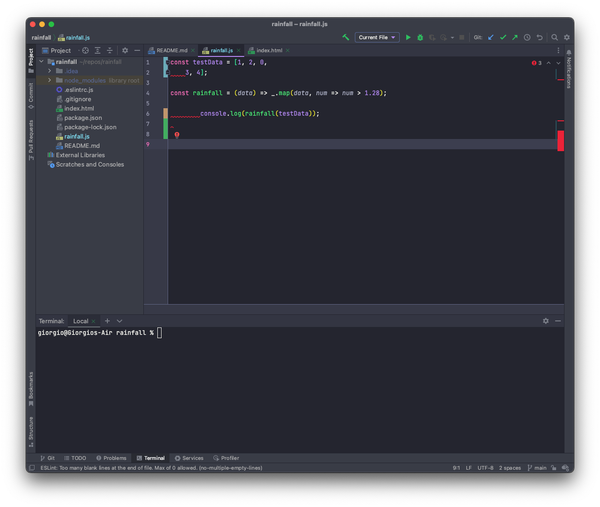

Imagine an alternate universe where coding standards do not exist. Tech giants have a colossal blob of code for each of their applications. Typos everywhere, misaligned lines, variables being declared and not being used, missing semicolons where they are needed, and the list goes on. Now imagine what it would be like in the office. Coworkers arguing about whether using single quotes is superior to double quotes. Engineers working 100-hour weeks and ripping out their hair trying to figure out each other's code. This hyperbole is how I see the world without coding standards.

Here's an example of such a code block:
```
function badCode() {
console.log('hello world');
		let x = 0;
for (let i = 0; i < 10; i++){let y = i}
console.log(x);
const array = [
'oh', 'this',
'code', "What", 'Am',
"I",
			'looking', 'at'
	]
return null;
}
```

#### Now, what exactly are coding standards?
They are stylistic rules set by conventions or organizations to provide consistency in code structure. Coding standards can improve the workflow of software engineers because they make code more legible, which in turn makes debugging easier for teams. An analogy to coding standards is writing styles such as APA, MLA, etc. These associations have guidelines on the structure of a paper, and it varies from field to field. The same goes for programming, where coding standards differ between certain languages or between organizations.

Example of ESLint doing some HEAVY lifting on pointing out errors:


#### Reducing pain with ESLint
<a class="md" href="https://eslint.org" target="_blank" rel="noopener noreferrer">ESLint</a> is every web developer’s best friend once they learn about it. It is a Javascript linter that analyzes code to ensure that style rules are followed. The style rules can be implemented by the user via the ESLint configuration file, which can be useful when working with teams. This linter also can come with built-in presets when you install it such as the popular <a class="md" href="https://github.com/airbnb/javascript" target="_blank" rel="noopener noreferrer">AirBnB style guide</a>. When there are inconsistencies between the code and the style settings, the code will be flagged. This can mediate a lot of the pain associated with code readability and debugging other people’s code.

<div class="d-flex justify-content-center align-items-center w-100 py-3 gap-3">
    
    <p style="font-size: 50px;"> ESLint </p>
</div>