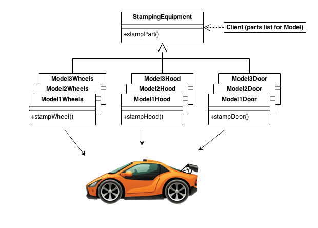
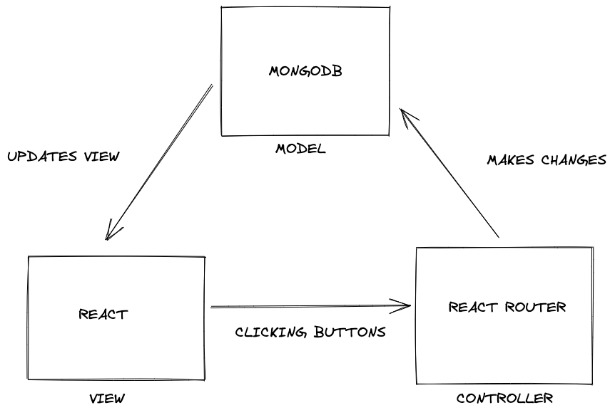

## Why Do We Need Them?

Design patterns are [typical solutions to common problems in software design](https://refactoring.guru/design-patterns). Problems that software engineers encounter have a high likelihood of already being solved. One of the most common decisions when building an application is determining what the big picture looks like when the frontend, the backend, and all the various APIs come together. That’s where design patterns come in. Knowing about their existence can help developers save money and time by providing an already existing template to build from.

_Example of a design pattern. Credit: https://sourcemaking.com/design_patterns/abstract_factory_

## Design Patterns in Action

There is an abundance of design patterns, and we will take a closer look at how they’re used. One such example that uses multiple types of design patterns is the [meteor-application-template-react (MATR)](link). This template is awesome because it lays a solid foundation of frontend and backend that can be built upon. Meteor is one of the technologies used in this template, and it uses the publication subscription design pattern. This design pattern does exactly as it sounds. An analogy for this would be subscribing to an online newsletter. The subscriber receives an email whenever the newsletter has something new to post. In the case of Meteor, the subscriber is the user and the newsletter is the data that gets added or removed from the user’s account. Another design pattern used in MATR is Model View Controller (MVC). This pattern, or variations of it, is widely used in modern applications. There is a Model, which is essentially a database, that updates the View, or what the user sees. Then the user can interact with the view via the Controllers such as clicking buttons that would manipulate the model in some way. Here’s a visual representation of the Model View Controller pattern with the tech stack in MATR:

_Drawn with Excalidraw. Credits: Design Patterns Module ICS 314_