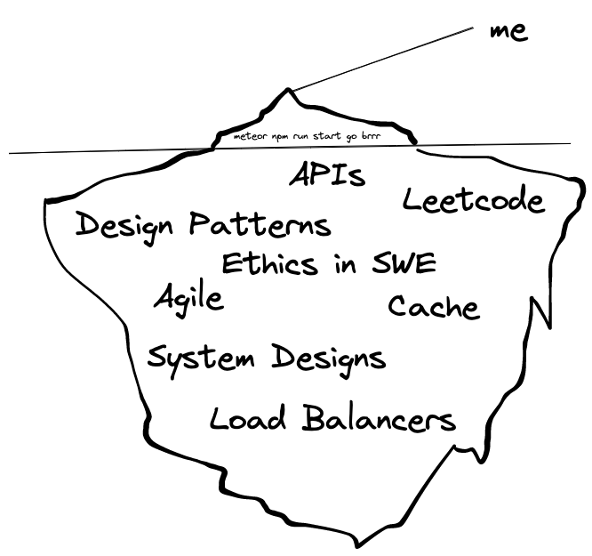

At the start of the semester, I came in thinking that I knew what software engineering was about, which was building web applications. That was a very naive mindset, and Software Engineering I at the University of Hawaii at Manoa really showed that what I knew was barely the tip of the iceberg. Building applications is only a minor part of the equation. There are other aspects that are equally important to being a great software engineer, and they range from agile project management to design patterns.

## Agile Project Management

Agile Project Management is a way for developers to effectively collaborate with each other via prioritized task distribution. A subset of Agile is Issue Driven Project Management IDPM, which breaks down a project into milestones, and within those milestones there are tasks that need to be accomplished. This style of project management really enhances the workflow of developers, and we were able to experience it while working on the final project. IDPM is something that I will use going forward, whether it is for personal projects or for group projects.

## Design Patterns

Design patterns was another very intriguing topic that was covered throughout the semester. There are a bountiful amount of them, and they are, in a nutshell, problems that have already been solved before. With the understanding of design patterns, developers can more efficiently design the architecture of the application. Existing design patterns can also be used as the baseline for more custom implementations to address developers’ needs.

With the knowledge that I gained in Software Engineering I, I have now moved 2 meters from the tip of the iceberg, and I still have many more kilometers to go.

