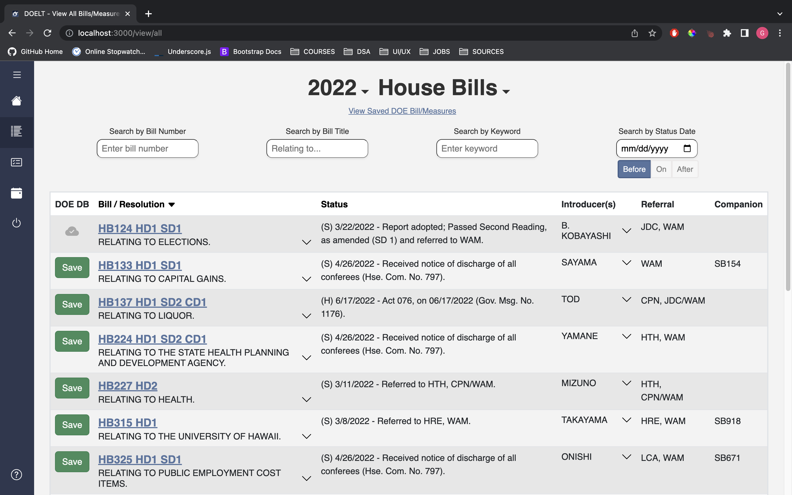

For the 2022 Hawaii Annual Code Challenge, our team built a modern legislative tracker for the Department of Education (DOE). With the 2-week time frame to complete the project, I designed the architecture of the application, and I created a scraper API using Express and cheerio.js. The scraper API acts as a proxy between the client and the State Capitol's legislative site. With the scraper, the application has real-time updated legislative data, which could subsequently improve the workflow of the DOE. Aside from the architecture and the scrapers, I helped implement some of the pages in the application with React and Bootstrap.

