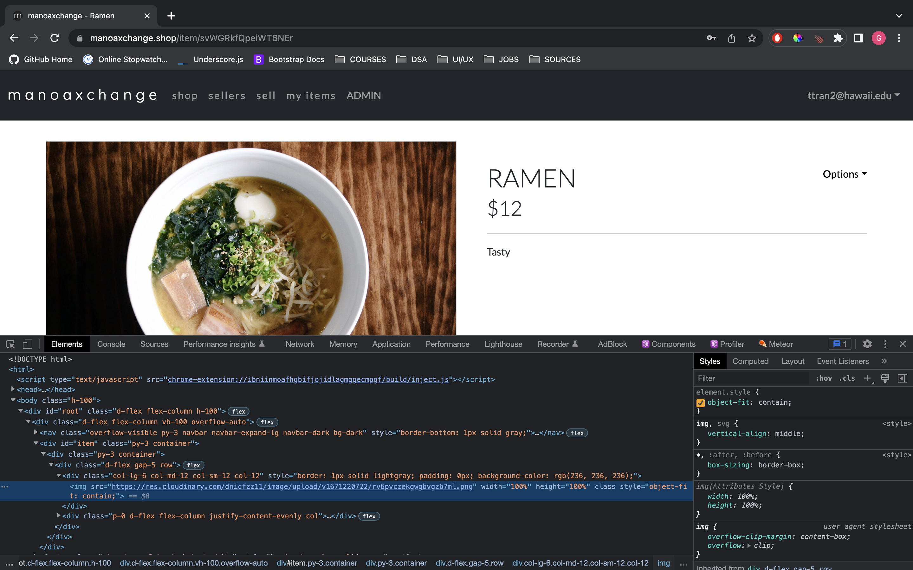

ManoaXchange is a web application prototype designed to help UH Manoa students, faculty, and alumni sell and buy items. This application would help the UH community repurpose and reuse goods. I led this project by designing the architecture of the application, designing the UI/UX, and lastly using the Gmail API and Cloudinary API. I created API endpoints via Express to establish communication between the client and the other two APIs. A highlight from this project was the implementation of image uploading. Upon uploading an image, the user is able to see a preview of the image. Once submitted, the image's data URL is uploaded to Cloudinary by being sent as a parameter through the API endpoint. Then, the response returns Cloudinary's URL of the image, which is then stored in MongoDB and used as the image source. Overall, this application taught me a lot about using APIs and creating a mobile responsive user interface.

Image uploading with preview.

Upon upload, the image is posted to Cloudinary, and the src of the image is a link obtained from Cloudinary's response.
